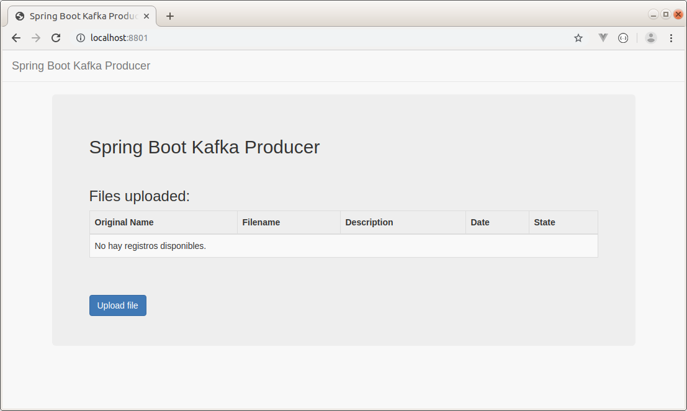
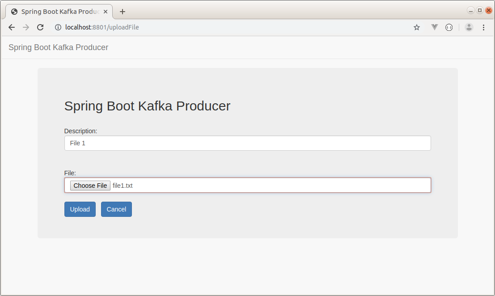
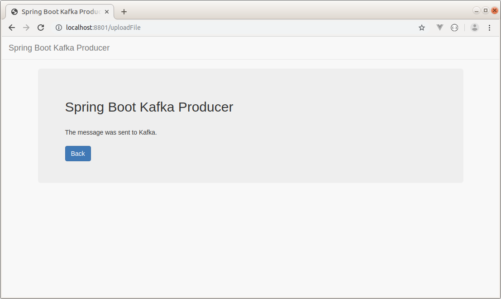
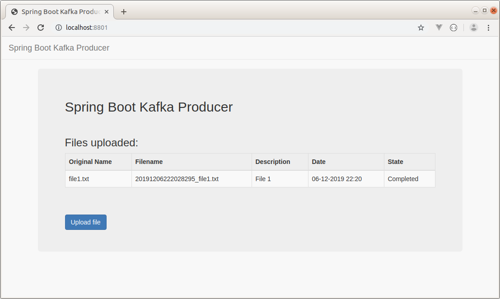

KAFKA PROJECT WITH SPRING BOOT
-----------------------------------------------------------------------------------------------------------------

Se desarrollan proyectos Spring Boot, que envían y reciben mensajes desde servidor Apache Kafka.

En el proyecto "Producer" se pueden realizar uploads de archivos.

Una vez que un archivo fue subido al servidor, se almacena un registro en base de datos y
se gatilla un mensaje a Kakfa, el cual es recibido por la aplicación "Consumer".

La aplicación "Consumer" recibe el mensaje del upload realizado, procesa el archivo y 
cuando finaliza actualiza el estado del registro almacenado en la base de datos.

-----------------------------------------------------------------------------------------------------------------

Página inicial de aplicación "Producer":

-----------------------------------------------------------------------------------------------------------------

Página para realizar upload de archivo:

-----------------------------------------------------------------------------------------------------------------

Envío de mensaje a aplicación "Consumer" por medio de Kafka:

-----------------------------------------------------------------------------------------------------------------

Una vez que la aplicación "Consumer" procesa el archivo, el registro pasa del 
estado "Processing" al estado "Completed":

-----------------------------------------------------------------------------------------------------------------
