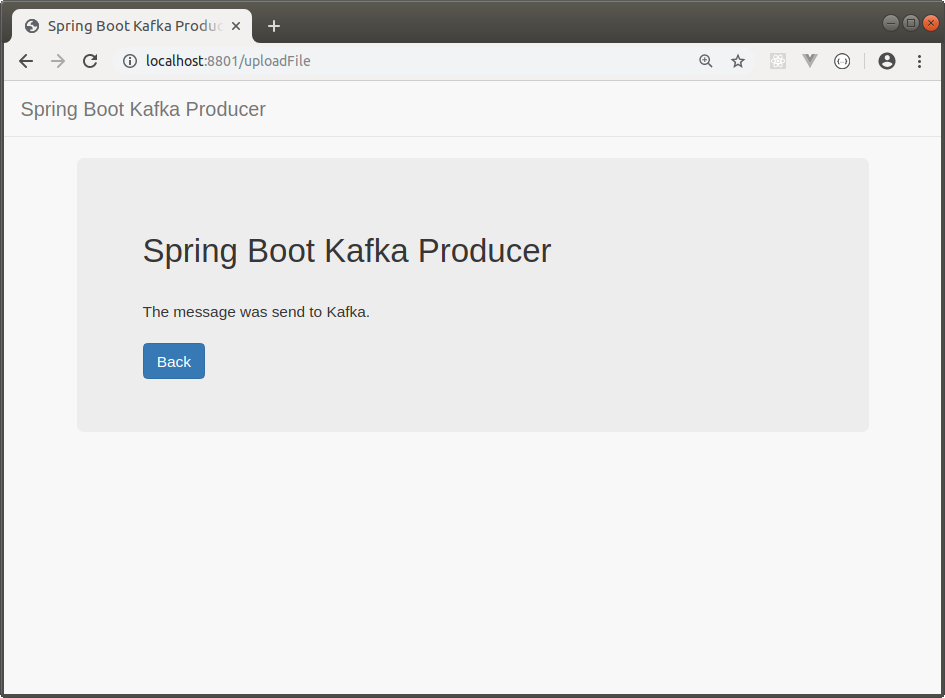

KAFKA PROJECT WITH SPRING BOOT
-----------------------------------------------------------------------------------------------------------------

Se desarrollan proyectos Spring Boot, Consumer y Producer, que envían y reciben mensajes desde
servidor Apache Kafka.

-----------------------------------------------------------------------------------------------------------------

En pagina inicial se despliega listado de uploads realizados:

-----------------------------------------------------------------------------------------------------------------

Pantalla donde se ejecuta un upload de archivo:

-----------------------------------------------------------------------------------------------------------------

Una vez realizado el upload, se registra en base de datos y se gatilla llamada a Kafka
para que la aplicación consumer sea notificada y procese el archivo subido:

-----------------------------------------------------------------------------------------------------------------
