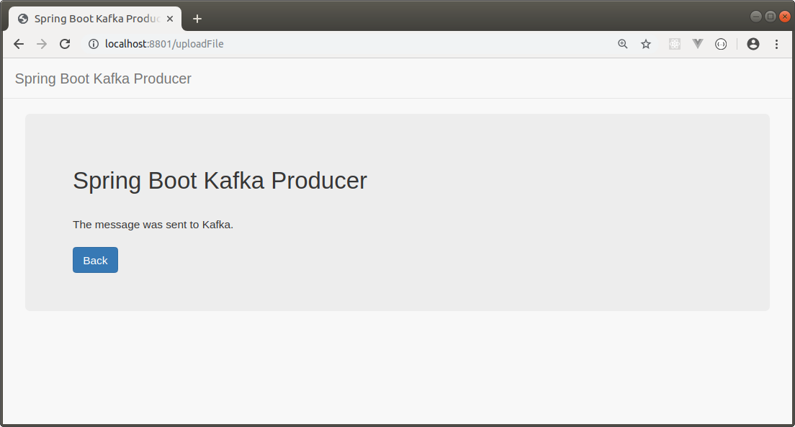

KAFKA PROJECT WITH SPRING BOOT
-----------------------------------------------------------------------------------------------------------------

Se desarrollan proyectos Spring Boot, que envían y reciben mensajes desde servidor Apache Kafka.

En el proyecto "Producer" se puede realizar uploads de archivos.

Una vez que un archivo fue subido al servidor, se almacena un registro en base de datos y
se gatilla un mensaje a Kakfa, el cual es recibido por la aplicación "Consumer".

-----------------------------------------------------------------------------------------------------------------

En pagina inicial se despliega listado de uploads realizados:

-----------------------------------------------------------------------------------------------------------------

Pantalla donde se ejecuta un upload de archivo:

-----------------------------------------------------------------------------------------------------------------

Pantalla desplegada luego de subir un archivos y notificar a la aplicación Consumer:

-----------------------------------------------------------------------------------------------------------------
